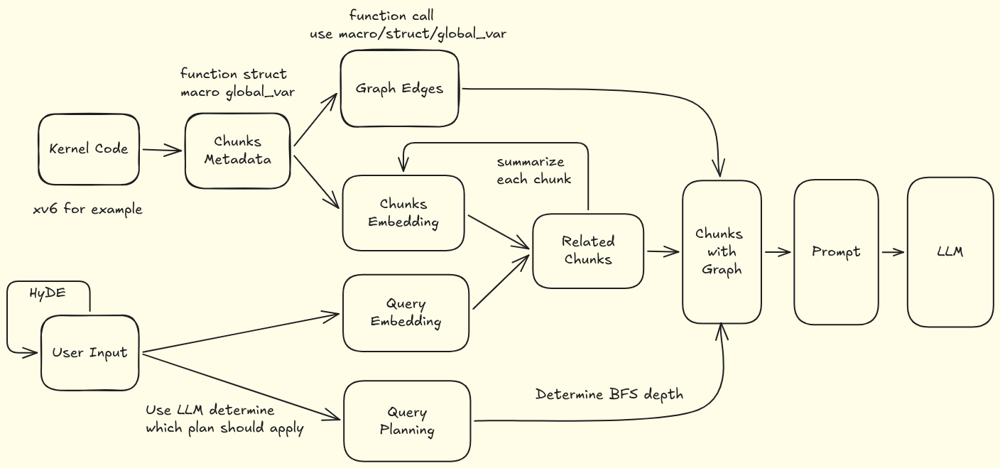

# xv6-graphRAG

This project is a GraphRAG-style assistant for exploring the [xv6-riscv](https://github.com/mit-pdos/xv6-riscv) kernel. The project has been refactored into a four-class pipeline with a unified runtime entrypoint.

## Architecture



The `src` directory now keeps only the core modules:

```text
src/
├── KnowledgeIndexer.py   # Offline pipeline: parse code, build graph, build embeddings
├── QueryProcessor.py     # Online query understanding: HyDE + query embedding + planning
├── GraphRetriever.py     # Retrieval core: FAISS seed search + graph traversal expansion
├── ResponseGenerator.py  # Prompt assembly + final LLM response
├── main.py               # Unified CLI entrypoint
├── config.py             # Paths, model settings, planner strategy config
├── utils.py              # Shared IO, text formatting, and LLM call helpers
└── __init__.py
```

## Data Flow

1. `KnowledgeIndexer` reads xv6 source and `compile_commands.json`, then writes:
   - `data/chunks_metadata.json`
   - `data/graph_edges.json`
   - `data/faiss.index`
2. `QueryProcessor` receives user query, runs HyDE, builds query embedding, and generates query plan.
3. `GraphRetriever` runs Top-K retrieval on FAISS and expands related chunks using plan-guided graph traversal.
4. `ResponseGenerator` assembles markdown context, calls LLM, and writes final output to:
   - `data/search_results_with_graph.json`
   - `data/prompt.md`

Index building is no longer a set of standalone scripts. It is part of the integrated pipeline executed by `main.py`.

## Tech Stack

- Retrieval architecture: GraphRAG (vector retrieval + graph traversal)
- Embeddings: `sentence-transformers` (`BAAI/bge-small-en` by default)
- Vector index: `faiss-cpu` (`IndexFlatL2`)
- Code parsing: `libclang` Python bindings (`clang.cindex`) over xv6 compile DB
- Graph construction: AST-based relations (`CALLS`, `USES_STRUCT`, `USES_GLOBAL`, `MACRO_USE`)
- Query understanding: HyDE query expansion + LLM-based query planning
- Prompting/answering: chat-completions style LLM API (configurable via `.env`)
- Runtime: Python 3, `python-dotenv`, standard JSON/CLI pipeline

## Setup

1. Prerequisites:
   - Python 3.10+
   - `libclang` (`sudo apt install libclang-dev`)
   - `bear` (`sudo apt install bear`)
   - xv6 build toolchain
2. Install dependencies:

```bash
python -m venv .venv
source .venv/bin/activate
pip install -r requirements.txt
```

3. Configure `.env` (optional if you only want retrieval without LLM answers):

```env
LLM_API_URL="https://api.deepseek.com/chat/completions"
LLM_TOKEN="your-token"
LLM_MODEL="deepseek-chat"
EMBEDDING_MODEL_NAME="BAAI/bge-small-en"
EMBEDDING_BATCH_SIZE="64"
```

## Usage

### Full rebuild

```bash
make rebuild
```

### Build compile database only

```bash
make compile-db
```

### Build index artifacts only

```bash
make index
```

### Ask a query

```bash
make query Q="how does the trap path reach usertrap?"
```

or run directly:

```bash
.venv/bin/python -m src.main "how does the scheduler switch process context?"
```

To force re-indexing in direct mode:

```bash
.venv/bin/python -m src.main "index warmup" --rebuild-index
```

## Outputs

- `data/chunks_metadata.json`: extracted code chunks
- `data/graph_edges.json`: graph relationships
- `data/faiss.index`: vector index
- `data/prompt.md`: merged retrieval context for LLM
- `data/search_results_with_graph.json`: final response payload

## License

[MIT License](LICENSE)
